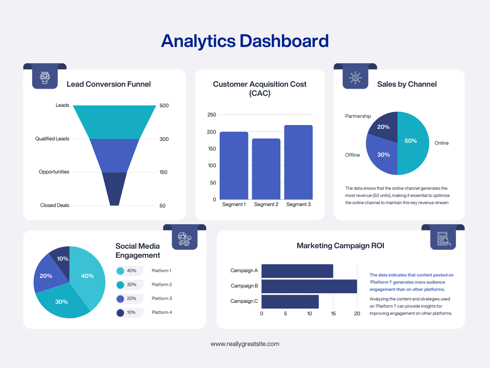

## Portfolio

---

### [Data Dashboards](/Tableau_Dashboards)
 
   

---

### Python 

[Find and Delete Missing Data](/Find_and_Delete_Missing_Data)
 

 
---

[Separate Duplicate Data](/Separate_Duplicates_from_Dataset)
 

<!--
[Profitable App Profiles for the App Store and Google Play Markets](/pdf/sample_presentation.pdf)
 

---

[Profitable App Profiles for the App Store and Google Play Markets](http://example.com/)

---

### Category Name 2

- [Project 1 Title](http://example.com/)
- [Project 2 Title](http://example.com/)
- [Project 3 Title](http://example.com/)
- [Project 4 Title](http://example.com/)
- [Project 5 Title](http://example.com/)

---
-->

---

Page template forked from <a href="https://github.com/evanca/quick-portfolio">evanca</a>

<!-- Remove above link if you don't want to attibute -->
